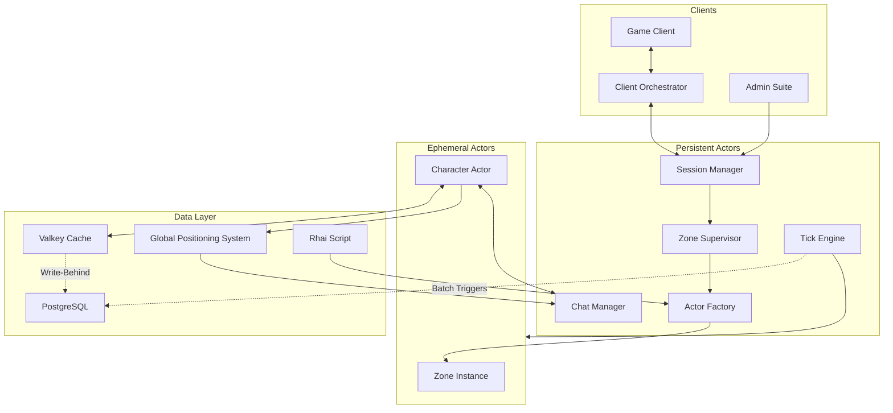

# DDS Distributed Systems Server Design Document

## What is DDS?

DDS is a theoretical design for an ideal MMORPG server emulator. It is designed to stable, scalable, and agnostic. Properly implemented, it should be more akin to a game engine specifically geared for MMORPG server emulators rather than a server in and of itself. To achieve this goal, it relies on the Actor model (published by Carl Hewitt, Peter Bishop, and Richard Steiger in 1973 and leveraged by Joe Armstrong, Robert Virding, and Mike Williams at Ericsson in 1986 to solve telecommunication scale with their Erlang language) written in Rust and Rhai. Today, we can use these ideas to make a highly performant and stable server emulator to preserve the games we love.

## What is DDS NOT?

DDS is not a functioning or even a developed server. It has not been proven in any form. I cannot say for certain that the designs laid out in this document can solve the problems we are facing today, but I believe it can.

## Why DDS?

Historically, server emulators are written as monolithic applications with SQL databases for persistence. C++ is usually the language of choice here, along with Lua scripting. The solutions we have now are truly inspirational achievements. I can say for certain that DDS as a design would not exist without their efforts. Without applications like MaNGOS or ProjectXI, I would have never sat down and thought through these designs. To the developers of the modern server emulator, I thank you. That being said, most of these projects have existed in some form prior to Rust's development and such, memory safety has plagued these projects. This leaves them far more unstable and saps time and effort from developing the content their communities crave. Just like how the Word Processor has taken the place of the typewriter, I think it is time we use memory-safe tools to replace our legacy ones.

Another shortcoming is the usage of the Object Oriented Programming paradigm for development. OOP has been a workhorse in the community, allowing for these projects to function whereas other designs would have failed. However, the traditional OOP model is extremely difficult to scale horizontally. Concurrency quickly becomes a nightmare of race conditions as shared mutable states lead to data corruption and crashes. The usage of mutexes helps mitigate these issues but comes with its own tradeoffs of performance and complexity. That's where the Actor Model comes in. In the Actor Model, every relevant piece of data is an isolated actor. In the context of Rust, the actor owns itself and only it can modify its own data. What instead happens is messages are passed between actors, instructing them on how to change their internal data. This allows for strong concurrency without mutexes, prevents data races, and makes the server scalable.

## Components of DDS

DDS is not designed to be a single application, but rather as a suite. There are five components to make the experience complete. The first and most foundational is the server. This is where everything is done. Secondly is the cache. This provides the hot state to hold our rapidly changing data. Third is the database, this is the cold storage of the cache and our persistence for server restarts. Fourth is the client orchestrator, which wraps the game client and manages the connection with the server. Last is the admin suite headless client. This provides a highly performant application for admins and game masters to manage their server. We'll be breaking down the designs for each in the following sections.

## The Server

The server itself is composed of a few components. There are a few persistent actors in the design: the Session Manager, the Zone Supervisor, the Actor Factory, and the Tick Engine. Everything else is an ephemeral actor that only exists as long as needed and automatically cleaned up.

### The Actor Model

The Actor Model (Carl Hewitt et al., 1973; popularized by Erlang) treats every concurrent entity as an isolated actor that:

* Owns its private state (no shared mutable data).
* Communicates only via asynchronous messages (no direct method calls).
* Processes one message at a time (serial execution per actor → no internal races).
* Can spawn new actors, send messages, and change behavior.

In DDS, this manifests as:

* Isolation eliminates data races - Character, Monster, or ZoneInstance actors own their state (position, HP, inventory). Only they mutate it in response to messages (e.g., "move to X", "take damage").
* Message-passing for concurrency - Actors communicate via Tokio channels (safe, async). No locks needed → fearless scaling across threads/nodes.
* Supervision for resilience - Persistent actors (Zone Supervisor, Actor Factory) monitor children. On crash/panic, supervisors restart/recreate with state rehydrated from Valkey.
* Location transparency - With ractor_cluster, messages work seamlessly local or remote → true distributed scaling (player hops zones across machines without code changes).

This yields:

* Deterministic behavior (via Tick Engine sync).
* Fault isolation (one zone crash doesn't take down the server).
* Horizontal scaling (spawn ephemeral actors on-demand).

Rust offers several actor frameworks, but not all suit distributed, game-server workloads. As of early 2026, here's a quick comparison of the main contenders:

| Framework | Key Strengths                                                                 | Distributed/Cluster Support                          | Maturity/Status (2026)                          | **Recommendation for DDS?**                                                                 |
|-----------|-------------------------------------------------------------------------------|------------------------------------------------------|-------------------------------------------------|---------------------------------------------------------------------------------------------|
| Ractor    | Erlang-like (gen_server inspiration), lightweight, supervision trees, Tokio-native, very low overhead | Yes (via `ractor_cluster` crate for networked actors, node discovery) | Active (v0.15.10 releases Dec 2025, ongoing commits) | **Strong yes** - Best match for DDS: distributed-first, supervision-focused, lightweight for many ephemeral actors (zones/characters). |
| Actix     | Mature, high-performance, used in web (Actix-web)                             | Limited (no built-in cluster; more local/web-focused) | Actix actor lib soft-deprecated; focus shifted to web | **No** - Too web-oriented, less emphasis on supervision/distributed.                       |
| Coerce    | Distributed focus, good for clusters                                          | Strong                                               | Active, comparable perf                         | Good alternative if more RPC-like needed; slightly heavier.                                 |
| Kameo     | Versatile, local + distributed, clean API                                     | Yes                                                  | Active, low memory in benchmarks                | Solid runner-up; very similar perf to Ractor.                                               |
| Xtra      | Lightweight, flexible                                                         | Limited                                              | Active but smaller community                    | Possible, but less distributed tooling.                                                     |

Recommendation: Stick with Ractor (as in the original design). It provides the closest Erlang-style supervision and clustering via ractor_cluster, is actively maintained (latest releases Dec 2025), has excellent perf/memory in recent benchmarks (similar to Kameo/Coerce), and aligns perfectly with DDS's persistent/ephemeral split + dynamic spawning. If distributed needs evolve, ractor_cluster handles node linking/message routing transparently.

Addendum: Ractor_cluster isn't considered production ready and work is being done on it as of early 2026. My personal opinion is that the horizontal scaling inherent to this design can make even a single node server able to handle large enough populations that a need for a full distributed cluster is long enough away for the crate to mature.

### The Tick Engine

The Tick Engine is an atomic clock process within the server. It incrementally counts up at certain intervals. Everything else in the server references the Tick Engine for time. This keeps everything in sync across hardware and makes the server deterministic. This way things like in-game time, weather, monster respawns, etc., can be synchronized deterministically. Rust can implement this using an `AtomicU64` (or similar) for safe concurrent reads; all processes needing to reference time can read the current tick but not write to it.

### The Session Manager

The Session Manager is the liaison between the end user and the server. Its primary job is to authenticate a user trying to connect, assign a session token and receive and send out packets between the server and the Orchestrator. It also handles authentication of the Admin Suite trying to connect, verifying credentials and ignoring requests that fail to meet that criteria. At some point brute force protection should be added and possibly multi-factor authentication (MFA).

### The Zone Supervisor

The Zone Supervisor is a persistent actor and overall manager of Zone Instances. Every Zone on the server is an instance; from towns, to fields, to battlefields, to dungeons.

Key responsibilities include:

* Dynamic load balancing - For shared zones (e.g., open-world areas), distribute players across multiple instances based on current load, location, or grouping.
* Instance isolation - For instanced content, ensure complete separation (no cross-instance visibility or interference).
* Player migration - Coordinate seamless handoffs when a player moves between instances (e.g., zoning, teleporting), updating Valkey hot state and notifying relevant actors.
* Cleanup - Automatically terminate ephemeral Zone Instances when empty or expired, reclaiming resources without disrupting active gameplay.
* Party migration - Any time a party is formed within the same zone, or when party members join others in a zone, it falls to the Zone Supervisor to determine how to put all the players in the same instance together in the least resource intensive way

This design enables true horizontal scaling: add nodes as player count grows, spawn zones on-demand, and let the supervisor handle distribution.

Addendum: Zone Supervisor Scaling
In initial implementations, a single Zone Supervisor is acceptable for proof-of-concept. However, as player populations grow, the Zone Supervisor becomes a message-passing bottleneck.
The recommended evolution is to introduce a Zone Hypervisor that manages multiple Zone Supervisor actors, each responsible for a subset of zones (e.g., Supervisor A handles zones 1-50, Supervisor B handles 51-100). This creates a supervision hierarchy that scales horizontally while maintaining fault isolation.
The Hypervisor handles:

* Zone-to-Supervisor assignment and routing
* Load balancing across Supervisors
* Cross-supervisor coordination (e.g., party migrations between zone groups)
* Supervisor lifecycle management (spawn/restart)

Developers should design the Zone Supervisor API with this hierarchy in mind from the start, even if initially deploying with a single Supervisor. This avoids costly refactoring later.

### The Actor Factory

The Actor Factory is a persistent, centralized service that acts as the "birthplace" for all ephemeral actors. It reads Rhai configuration templates (pure data/blueprints for monsters, NPCs, items, quests, etc.) and hydrates new instances with initial state from Valkey (or PostgreSQL on cold start) for character related actors. It enforces consistent creation patterns, handles dependency injection (e.g., linking a Character Actor to its Zone Instance), and registers new actors with supervisors for monitoring.
By keeping configuration data-driven and separate from code, the Factory allows rapid iteration on content without recompiling the server. This is ideal for community-driven emulation projects.

Rhai is chosen as the configuration and blueprint language because it strikes an ideal balance for embedded, configuration-driven systems like game servers: lightweight, fast, tightly integrated with Rust, and memory-safe by design.
Key advantages include:

* Tight Rust integration - Rhai allows passing native Rust values into scripts (via Scope), calling Rust functions from scripts, and exposing Rust types as custom types/operators. This enables seamless "data as code" where blueprints (monsters, items, quests, zones) are defined in Rhai files, loaded at runtime, and hydrated into actors without recompiling the server.
* Safety and sandboxing - Scripts run in a controlled environment; they cannot mutate host state unless explicitly allowed. This prevents rogue configs from crashing the server or introducing exploits which is critical for community-driven content in emulators.
* Performance and lightness - Rhai is AST-interpreted (no heavy VM), with tiny memory footprint (~200KB base), no external dependencies, and support for no_std/WASM. Scripts can be compiled once and evaluated repeatedly for efficiency.
* Syntax accessibility - JavaScript/Python-like syntax makes it approachable for non-Rust contributors (content creators, modders), while remaining powerful enough for dynamic blueprints (functions, overloading, closures).
* Configuration-only philosophy - By restricting Rhai to pure data/templates (no runtime game logic), we keep core performance in Rust while enabling rapid iteration on entities, events, and rules-similar to how Lua powers many game engines but with better Rust affinity and safety.

This "data as code" approach (configs as executable blueprints) avoids recompiles for balance tweaks, enables community contributions via simple scripts, and aligns with modern configurable systems without the security/performance pitfalls of full scripting runtimes.

Rhai templates should define:

* For monsters and NPCs: name, stats, location, and moveset
* Abilities should be their human readable name and what they do
* Quests should be a list of states, the location of the next trigger, and requirements to progress through each state. For instance, triggering a quest could require talking to a NPC and being a certain level, that should be state 1.
* Monster and AI behaviors should be listed out in the Rhai template. This includes phases for a boss battle such as FFXIV's trials
* Class/Job definitions, lists of abilities, unlocks, stat adjustments, etc.

### Ephemeral Actors

All game entities beyond the core persistent ones are ephemeral:

* Zone Instances - Self-contained simulations of a specific area/instance. They own the runtime state of all contained actors (characters, monsters, objects) and process ticks, events, and messages locally. When no longer needed, they shut down cleanly, flushing final state via write-behind.
* Character Actors (and similar: Monster, NPC, Object, etc.) - Each represents one in-game entity. They own their mutable state (position, stats, inventory, etc.) and react only to messages (e.g., movement commands, combat events). This isolation eliminates shared mutable state, preventing race conditions and enabling fearless concurrency.

Ephemeral actors follow a strict lifecycle: spawned by the Factory → supervised by parents (Zone Instance → Zone Supervisor) → cleaned up on death, logout, or instance termination.

Addendum: Zone Optimizations to Consider

One core goal of DDS is efficient scaling. The base design achieves this through aggressive pruning: ephemeral Zone Instances and their child actors (characters, monsters, NPCs) are created on-demand and automatically cleaned up when no longer needed (e.g., empty zones, player logout).

To further optimize resource usage in large or sparsely populated zones, consider **spatial optimization** (aka proximity/interest management). The key is deciding when to fully destroy, deactivate ("sleep"), or keep actors alive based on player proximity.

| Scheme                                      | Benefits                                                                 | Drawbacks                                                                                  |
|---------------------------------------------|--------------------------------------------------------------------------|--------------------------------------------------------------------------------------------|
| **None** (full visibility, no culling)      | Simplest to implement; no extra logic needed                             | Wastes CPU/memory/network by generating and updating all zone actors regardless of player location |
| **Full Prune** (destroy outside range)      | Most efficient resource use; minimal memory footprint                    | Heavy load on Actor Factory during player movement; potential spawn latency spikes        |
| **Sleep Mode** (deactivate outside range)   | Efficient resource use; Actor Factory only called once per zone         | More complex implementation (state serialization/deserialization); less optimal than prune |
| **Hybrid** (prune far away, sleep nearby)   | Balances memory savings with spawn overhead; flexible per-zone tuning   | Most complex to implement; requires careful tuning for each zone type/use case            |

There is no single "best" scheme — it depends on zone density, player movement patterns, and content type (e.g., open-world fields vs. instanced dungeons). The recommended approach is to implement multiple schemes in the core, then expose a configuration option in each Zone's **Rhai blueprint** (e.g., `proximity_mode = "sleep"`, `sleep_threshold = 100.0`, `prune_threshold = 500.0`). This allows content creators to tune per-zone without core recompiles.

These optimizations pair well with spatial partitioning (grids/quadtrees) inside Zone Instances for fast "nearby" queries — reducing unnecessary messages and ticks even when actors are active.

Addendum: Advantages of Time Delays Before Destroying Empty Zone Instance Actors

One way to improve player experience and reduce spawn overhead is to introduce a configurable **grace period** (time delay) before the Zone Supervisor fully destroys an empty Zone Instance actor. During this period, the instance remains alive in a low-resource "hibernation" state (minimal ticking, child actors pruned or slept), ready for instant reactivation if a player returns.

| Time Delay Duration          | Key Advantages                                                                                  | Potential Drawbacks / Considerations                                      | Recommended Use Cases in DDS                              |
|------------------------------|-------------------------------------------------------------------------------------------------|---------------------------------------------------------------------------|-----------------------------------------------------------|
| **No delay** (immediate destroy) | - Maximum resource efficiency (CPU, memory, Valkey keys released instantly) - Simplest implementation - No risk of stale state accumulation | - High spawn latency for returning players (full recreation from Actor Factory) - Frequent create/destroy cycles thrash the Actor Factory and database - Feels jarring for brief exits | Low-density, rarely revisited zones (remote dungeons, one-time events) |
| **Short delay** (1–5 minutes) | - Catches most quick returns (forgot item, party invite, brief AFK) - Significantly reduces spawn overhead vs. immediate destroy - Still reasonably resource-efficient | - Minor wasted resources during grace period - Requires basic timer + state check logic | High-traffic open-world zones with frequent short exits/returns (cities, hubs, battlegrounds) |
| **Medium delay** (5–15 minutes) | - Excellent player experience: covers common re-entry patterns seamlessly - Greatly lowers Actor Factory load and cold-start latency - Ample time for safe background cleanup (e.g., Valkey → PostgreSQL flush) | - Moderate memory/CPU holding cost during idle periods - Slight risk of stale data (rare in DDS due to actor isolation) | General-purpose shared zones; strong default for most content |
| **Long delay** (15–60+ minutes) | - Near-zero perceived latency for returning players (zone feels persistent) - Maximizes immersion in social/open-world content - Plenty of time for admin monitoring or graceful shutdown | - Higher idle resource consumption - Potential for many dormant instances to accumulate - Needs careful monitoring on resource-constrained hardware | High-social hubs (major cities, auction house, popular quest areas) |
| **Very long / indefinite** (e.g., 60-minute warning before shutdown) | - Maximum immersion: zones feel truly persistent - Players can leave and return without reloads - Simplifies some design aspects (less aggressive pruning) | - Significant resource waste on low-traffic servers - Risk of server sprawl (too many lingering instances) - Requires robust resource monitoring | Premium/endgame social hubs; viable only on well-provisioned hardware |

**Recommendation**: Implement a configurable grace period per zone via Rhai blueprint (e.g., `grace_period_minutes = 10`). Start with a medium delay (5–15 minutes) as the default for most zones — it strikes the best balance between resource efficiency and smooth player experience. Combine with proximity/sleep optimizations for even better results during the grace period.

For non-shared instanced content, prioritize rapid cleanup to avoid resource waste and prevent exploits (e.g., lingering instances for farming or griefing). Recommended defaults:

* **On victory/failure**: No delay — destroy immediately after final state flush.
* **On timeout** (inactivity, all players leave): No delay or very short (0–5 min) grace period.
* **Duplicate instances** (multiple copies of the same template): No delay — destroy extras as soon as empty.

| Time Delay Duration                  | Key Advantages                                                                                  | Potential Drawbacks / Considerations                                      | Recommended Use Cases in DDS                              |
|--------------------------------------|-------------------------------------------------------------------------------------------------|---------------------------------------------------------------------------|-----------------------------------------------------------|
| **No delay** (immediate destroy)     | - Maximal resource efficiency - Prevents stale/duplicate instances - Simplifies anti-exploit logic | - High spawn latency for rare quick returns (e.g., DC during boss kill) | **Default for instanced content**: victory/failure, timeout, duplicates |
| **Short delay** (1–5 minutes)        | - Catches accidental DCs or quick re-queues - Low overhead for brief grace | - Minor idle cost; still needs timer logic                                | Instanced timeouts (e.g., party disband, all leave without wipe) |
| **Medium delay** (5–15 minutes)      | - Smooth for minor disconnects/rejoins - Time for safe Valkey flush                         | - Higher holding cost; less suitable for instanced (risk of waste)       | Shared/open-world zones only; avoid for pure instances    |
| **Long delay** (15–60+ minutes)      | - Near-persistent feel for social hubs                                                          | - High waste; unsuitable for instanced (exploits, resource sprawl)       | Major cities/hubs only; not for dungeons/raids            |

**Configuration Recommendation**: Expose per-zone settings in Rhai blueprints:
- `instance_type = "dungeon"` → auto-enforces no delay on victory/failure/timeout/duplicates.
- `grace_period_minutes = 0` (or small value for timeout edge cases).
This keeps the design flexible while defaulting to efficient, anti-abuse behavior for instanced content.
This approach ensures DDS handles instanced scenarios efficiently (quick recycle = low resource use, no lingering duplicates) while preserving the grace period benefits for shared zones. It mirrors how real WoW servers handle instances (aggressive resets on wipe/completion, with player-side lockouts preventing spam rather than instance-side delays).

### Data Caching

Even though caching is handled by Valkey, there are important things for it on the server side.

* All character actor data and their child actor data should be cached. This means inventories, quest markers, equipment, exp, currency, level, hp, etc.
* What should NOT go into cache: Zone, monster, or item data (static content).

All characters should be listed by location in the cache. This facilitates in-game searching, while also providing an address book for chat messages to be delivered. This system is called the GPS (Global Positioning System).

## The Cache: Why Valkey Over Redis?

Valkey serves as the primary cache and hot source of truth for active game state (character positions, inventories, temporary buffs, etc.). It enables fast reads/writes for real-time gameplay. Valkey was chosen as the in-memory cache over Redis due to its open-source commitment and growing adoption in 2026. Redis shifted to a restrictive license in 2024, prompting forks like Valkey (backed by the Linux Foundation, AWS, Google Cloud, Oracle, and others). By mid-2025, Redis reverted to AGPLv3, but community trust eroded, leading to Valkey's rapid rise. 83% of large enterprises tested or adopted it by late 2024, with distros like Fedora 41 replacing Redis entirely. Valkey is a drop-in replacement (compatible with Redis 7.2.4+), offers similar performance, and avoids licensing uncertainties. For emulators, its pub/sub for actor messaging and replication for durability make it ideal for hot state in distributed setups.

## The Database: Why PostgreSQL?

PostgreSQL handles cold, durable persistence:

* Write-behind strategy triggered by the Tick Engine (e.g., batched every N ticks or on critical events like logout/zone change).
* Ensures long-term storage and recovery after restarts.
* Supports complex queries for analytics, backups, or admin tools.
* Supports Rust's strict data types making development and deployment easier.

PostgreSQL was selected for its robustness in game emulators: ACID compliance for data integrity (e.g., preventing item dupes), stored procedures for complex logic, and high concurrency handling for write-heavy MMORPG workloads. It excels in scalability (horizontal via replicas), referential integrity, and performance for relational data like player profiles or inventories-proven in MMORPGs and outperforming alternatives like MySQL in advanced operations. For emulators, its flexibility (e.g., extensions like pgvector) supports innovative features without fragility.

Rhai scripts remain configuration-only-defining blueprints/templates, not runtime logic-to maintain performance and security.

## The Client Orchestrator: Why Rust with Qt Over C++ or Slint?

The Client Orchestrator is a Rust-based proxy that wraps the legacy game client, handling connections, packet translation, and addon management. Rust was chosen for its memory safety, preventing crashes common in legacy C++ emulators, while enabling high-performance concurrency for real-time proxying.
For the UI framework, Qt (via bindings like CXX-Qt) is preferred over native C++ applications or Slint. Native C++ lacks Rust's safety guarantees, leading to bugs in plugin handling or network code. Slint, while Rust-native and declarative (QML-inspired), is lighter but less mature for complex cross-platform UIs making it more suited for embedded applications than full desktop proxies with Wine integration. Qt's ecosystem is vast (widgets, QML), with official bridges emerging in 2025 for seamless Rust integration, preserving safety via CXX-Qt's bridging (extends CXX for QObject subclasses). Best practices: Use CXX-Qt for safe interop, instantiate QObjects from Rust modules, and leverage Qt's meta-system for dynamic UIs. This also avoids Slint's limitations in legacy bridging. C# applications are also popular in the space, but should be rejected as they look out of place on every desktop (I would argue they look out of place even on Windows) and are slow by Rust standards. Overall, it will be a smoother experience having Rust programs talking to other Rust programs as to not invite possible data breaches due to a lack of memory safety.

What should happen is when the Orchestrator is started up, a login is sent to the Session Manager in the server for login credentials. This would be the ideal spot to include MFA as well. Once the handshake is completed, the Session Manager should assign the Orchestrator a session token, then the Orchestrator would start the game client. This session token should be given a short expiration timer and be kept solely in the memory of the Orchestrator. In the event of a disconnect, dropped packets, or game client crash, the Orchestrator will try to reconnect to the Session Manager. If a connection is made, it gives the Session Manager its session token which is checked to see if it's still valid. If valid, then the connection is reestablished. Throughout the user's time on the server, the session token's timer should get renewed at certain intervals checked against the Tick Engine. This would also be the ideal place to put in an idle disconnect feature should the developer choose.

### How Client-Side Translation Works

The Orchestrator acts as a compatibility layer:

* Launches the original game client. In the case of a non-Native environment such as Linux, the Orchestrator should also handle the managing of Wine, Wine Prefixes, DXVK, and any other wrapper libraries needed to function correctly. Maximizing accessibility to all platforms is key.
* Translates legacy packets to modern server APIs (e.g., binary to JSON-like messages).
* Converts server responses back to legacy formats.
* Stubs unsupported packets, logging unknowns for reverse-engineering.

This enables legacy clients to interface with the distributed actor system without modifications, using Rust's async (Tokio) for low-latency proxying.

### Opportunities for DLL Injection and Plugin Reporting

DLL injection allows extending the client with addons (e.g., UI mods like Windower/Ashita in FFXI). The Orchestrator supports injection for legit plugins, reporting loaded DLLs to the server for whitelist validation-preventing cheats while enabling community mods. Server commands can unload non-whitelisted DLLs, enhancing security.

## The Admin Suite: Capabilities

The headless Admin Suite (Rust + Qt/Kirigami) provides GM tools without game rendering:

* Authentication - Validates against GM accounts.
* Player Management - Move/kick/ban/jail players, send messages.
* Monitoring - Real-time logs, chat streams, player locations, server metrics (e.g., active players, resource usage).
* Stateless Observer - No in-game entity; pure interface for remote admin.
* For legal safety, shipping the headless client without game assets would be best. A single use of any copyrighted work opens the project up to legal repercussions.

Qt ensures cross-platform lightness, ideal for admins on varied setups.

### Resilience & Fault Tolerance

* Supervision trees - Persistent actors supervise ephemerals (one-for-one restart on panic/crash).
* Determinism via Tick Engine - Global atomic clock prevents timing drift across nodes.
* Session resilience - Tokens enable quick reconnections; state rehydrates from Valkey.
* Crash recovery - Valkey replication + PostgreSQL WAL minimize data loss; write-behind batches reduce DB pressure.

In the case of a data stack crash, this would be the ideal way to handle it. In a situation where PostgreSQL goes down, but Valkey is is still up, the cache writing actor should try to reconnect. With each failed reconnect it should double the wait time to avoid hammering the database. After it exhausts its reconnection attempts, it informs the server to go into "Limp Mode." In this mode, every logged in player should be sent an automatic message about the degraded state of the server and recommend logging out. New connections should be refused. During normal scheduled batch writes to PostgreSQL should instead be outputted to sql files.

In the case of Valkey going down, but PostgreSQL is still up, "Limp Mode" should be enabled immediately. Character information should be written directly to PostgreSQL, and the GPS should operate on an internal backup actor. If enough time goes by, the server should gracefully log out all remaining players, save data to PostgreSQL and shutdown.

In the case where both Valkey and PostgreSQL are down, the server should automatically refuse all requests to connect, gracefully log out all remaining players and output the information as an sql file.

In all three cases, an alert should go out to the admins. This would be an excellent spot to tap into a Discord bot and the Admin suite to inform server owners that their server has degraded.

## Some Unsorted Thoughts

* Any deployment of this design should license the core server implementation under the **AGPLv3** (GNU Affero General Public License v3). To understand my perspective, read [Why I Hate Most WoW Private Servers](https://github.com/FrancescoBorzi/why-I-hate-wow-private-servers/blob/master/ENGLISH.md), which powerfully critiques the common practice of taking open-source emulator code, applying fixes or improvements, and keeping them private—often while monetizing via donations—while violating the spirit (and letter) of copyleft licenses. The AGPLv3 is a strong copyleft license specifically designed for networked applications: it requires that if users connect to a modified version over a network (e.g., players logging into a public server), the operator must make the corresponding source code available to them at no charge. For more details, see the [GNU Affero General Public License v3](https://www.gnu.org/licenses/agpl-3.0.en.html). I fully recognize that people will use this design however they wish, including in corporate or commercial contexts. In such cases, I strongly recommend keeping the core implementation (the actor framework, supervisors, tick engine, etc.) open under AGPLv3 to foster collaboration and prevent the hoarding that has historically fragmented and slowed progress in the emulator community. Since the server is inherently stateless by design, proprietary or **All Rights Reserved (ARR)** licensing can still apply to game-specific content (the database schema and Rhai script templates), providing a viable path for offering paid or subscription-based MMORPG services while complying with the license for the shared core.

* This core can conceptually support any MMORPG, and we should lean into the power of collaborative effort. The only truly game-specific components are the packet translators in the Client Orchestrator, the database schema, and the Rhai script templates. Everything else—the Actor Factory, Session Manager, Zone Supervisor/Hypervisor, Tick Engine, GPS system, Valkey caching layer, fault-tolerance mechanisms, and even the Admin Suite—can and should remain game-agnostic. The actors themselves are stateless by design and derive their behavior and state either from Rhai definitions (for blueprints) or the database schema. Because the core can be shared across projects, developers from WoW, EverQuest, Final Fantasy XI/XIV, Lineage 2, and beyond could collaborate on the same foundation, then focus solely on their own content. This approach saves massive amounts of duplicated effort and accelerates progress across the entire emulation space.

* The ideal development and distribution strategy is to target **Linux only** and ship via **Docker containers**. While Rust makes multi-platform builds (Windows, macOS, BSD, etc.) relatively easy compared to C++, the server is already a complex application, and that effort is better spent on core features, optimizations, and documentation. Docker containers run on any modern operating system with Docker support, providing a consistent runtime environment across all deployments. This greatly simplifies debugging, eliminates the dreaded "it runs on my system" excuse, and makes reproducing bugs straightforward. When supporting admins who run the server natively on multiple platforms, the complexity and time required for troubleshooting explode. Resources are better invested in writing excellent **Docker Compose** examples, health checks, volume management, and scaling guides for containerized deployments.

## Why This Matters for MMORPG Emulation

Legacy emulators excel at content fidelity but struggle with concurrency, memory safety, and horizontal scaling. DDS flips the script: Rust + Actor Model delivers safety and performance; write-behind caching + dynamic instancing handles massive player loads; data-driven configs empower communities.
This is not a claim that DDS solves everything; it's a vision for what an ideal, modern emulator could be. Legacy projects like LandSandBoat (still very active with daily commits as of January 2026) provide the content foundation; a Rust/actor rewrite could take scalability to the next level.

This document is shared freely as a theoretical design in the hope it inspires better, more scalable MMORPG emulators. If you use ideas, patterns, architecture, or code inspired by DDS (or fork a project that does), I would greatly appreciate a link back to this document. Somewhere in the README, credits, or even just a mention on a forum post. Implementations live and die, but ideas can live forever. Godspeed, developer.
